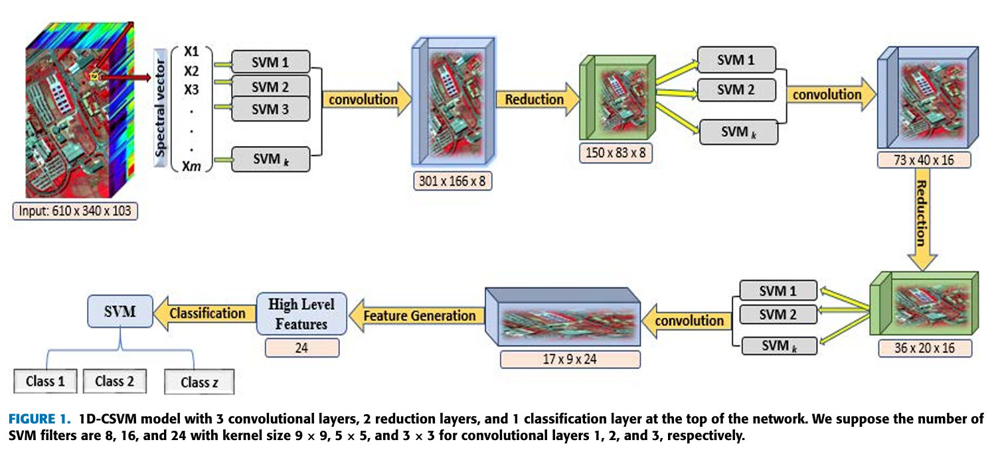
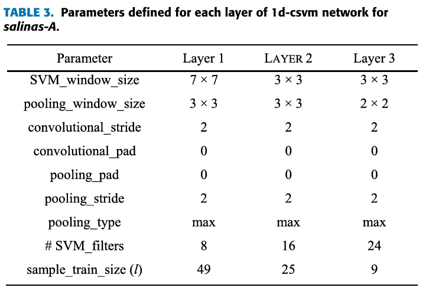

# Detailed Summary of the Paper

This summary is based on information from the published paper: [Pixel-Wise Classification of Hyperspectral Images With 1D Convolutional SVM Networks](https://ieeexplore.ieee.org/stamp/stamp.jsp?tp=&arnumber=9996412)

## Table of Contents

- [Introduction](#introduction)
- [Datasets](#datasets)
- [Model](#model)
  - [3D CNN Layers](#3d-cnn-layers)
  - [2D CNN Layer](#2d-cnn-layer)
- [Output Shape](#output-shape)
- [Training](#training)
- [Hardware](#hardware)
- [Results](#results)
  - [Benchmarking Tool](#benchmarking-tool)

## Introduction

The 1D-CSVM paper proposes a combination of SVM and 1D-CNN architectures that performs on par with 2D- and 3D-CNNs. The 1D-CNN model analyses each pixel’s information individually by relying solely on spectral information.

## Datasets

[Link to all three datasets](https://rslab.ut.ac.ir/data)

**Salinas Scene (SA)**

- Spatial dimensions: 512 × 217 pixels
- Spectral bands: 224
- Wavelength range: 360 to 2500 nm
- Water absorption bands discarded in the experiment: 20
- Ground-truth classes: 16

**Kennedy Space Center (KSC)**

- Spatial resolution: 18 m
- Spectral bands: 176
- Wavelength range: 400 to 2500 nm
- Ground-truth classes: 13

**Pavia University (PU)**

- Spatial dimensions: 610 × 340 pixels
- Spectral bands: 103
- Wavelength range: 430 to 860 nm
- Ground-truth classes: 9

**Indian Pines (IP)**

- Spatial dimensions: 145 × 145 pixels
- Spectral bands: 224
- Wavelength range: 400 to 2500 nm
- Water absorption bands discarded in the experiment: 24
- Ground-truth classes: 16

## Model

1D-CSVM consists of 3 convolutional layers, 2 reduction layers, and 1 classification layer.

**Window and SVM Filters Size**

For **Salinas Scene (SA)**

- Window: 7×7, 3×3, 3×3
- Filters: 8, 16, 24

For **Kennedy Space Center (KSC)**, **Pavia University (PU)**, and **Indian Pines (IP)**

- Window: 9×9, 5×5, 3×3
- Filters: 8, 16, 24

## Parameter

## Training

- Randomly split the pixels into training and validation sets using ratios of 30:70, 50:50, or 70:30. It seems that the authors only used training and validation sets. Although the test set was mentioned in the paper, it appears to refer to the validation set.
- No batch normalisation or data augmentation was used.

### SVM Filters

For each SVM filter, the author randomly pick n training examples from the training set. The number of random samples depends on the layer:
- Layer 1: n=49
- Layer 2: n=25
- Layer 3: n=9

The SVM filter weights are learned using the **Liblinear-multicore-2.11-1** package. For each SVM, the regularisation parameter C is chosen via three-fold cross-validation, typically ranging between 10^-1 and 10^3 values.

The **max-pooling** operation is applied in all three reduction layers.

## Hardware

According to the paper, all experiments were conducted with the following specifications:

- NVIDIA GTX 1050 4G (GPU)
- IntelR Core i7-7700HQ
- 16 GB RAM

## Results

The authors evaluated model performance using the following metrics:

- **Overall Accuracy (OA)**
- **Average Accuracy (AA)**
- **Kappa Coefficient (Kappa)**

The results show that the 1D-CSVM provides state-of-the-art performance and even outperforms 2D- and 3D-CNNs.