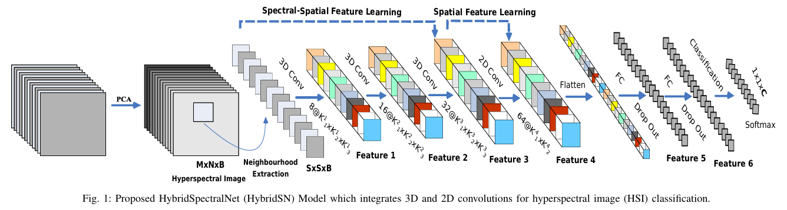
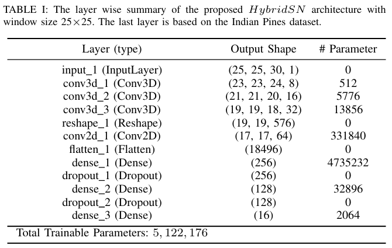

# Detail Summary Of The Paper

[Exploring 3D–2D CNN Feature Hierarchy for Hyperspectral Image Classification](https://arxiv.org/abs/1902.06701)

## Introduction

The relationship bewteen 2D-CNN and 3D-CNN has been the benefits and trade offs that both architecture entail. 2D-CNN is very computationally simplier, but could not capture the spectral relationship. Where as, 3D-CNN is computerationally expensive and usually perform worse for categories that have similar texture over many spectral bands.

### Dataset

[Link to all three dataset](https://www.ehu.eus/ccwintco/index.php/Hyperspectral_Remote_Sensing_Scenes)

The Indian Pines (IP) dataset
- 145 × 145 spatial dimension (pixels)
- 224 spectral bands
- 400 to 2500 nm wavelength range
- 24 water absorbing spectral bands (discarded from the experiment)
- 16 classes of ground truth

The University of Pavia (UP) dataset
- 610 × 340 spatial dimension (pixels)
- 103 spectral bands
- 430 to 860 nm wavelength range
- 9 classes of ground truth

The Salinas Scene (SA) dataset
- 512 × 217 spatial dimension (pixels)
- 224 spectral bands
- 360 to 2500 nm wavelength range
- 20 water absorbing spectral bands (discarded from the experiment)
- 16 classes of ground truth

## Model

### Input patch size & PCA

IP & SA
- input patch size = 25 × 25
- PCA-reduced spectral bands = 30

UP
- input patch size = 25 × 25
- PCA-reduced spectral bands = 15

### 3D CNN layers

number of filters × kernel height × kernel width × kernel spectral depth × number of input feature maps.

First layer is 8 × 3 × 3 × 7 × 1
- 8 filters
- 3 x 3 x 7 kernel size
- 1 input

Second layer is 16 × 3 × 3 × 5 × 8
- 16 filters
- 3 x 3 x 5 kernel size
- 8 inputs

Third layer is 32 × 3 × 3 × 3 × 16
- 32 filters
- 3 x 3 x 3 kernel size
- 16 inputs

### 2D CNN layers

number of filters × kernel height × kernel width × kernel spectral depth × number of input feature maps.

Single layer is 64 × 3 × 3 × 576
- 64 filters
- 3 x 3 kernel size
- 576 inputs

## Output shape

Output shape for IP & SA

The number of node in the last dense layer depends on the classes of the dataset therefore it is 16, 9, and 16 for IP, UP, and SA dataset repectively.

The total number of trainable weight parameters in HybridSN are
- IP: 5,122,176
- UP: 4,844,793
- SA: 4,845,696

## Training

- 30% and 70% of the data are randomly divided into training and testing groups
- All weights are randomly initialised
- Using back-propagation algorithm with the Adam optimiser and the softmax loss
- learning rate of 0.001
- mini batches of size 256 
- 100 epochs with no batch normalization and data augmentation.

## Method

We have chosen the optimal , based on the classification outcomes. In order
to make the fair comparison, we have extracted the same
spatial dimension in 3D-patches of input volume for different
datasets, such as 25×25×30 for IP and 25×25×15 for UP
and SA, respectively.

### Hardware

Based on the papper all experiments are conducted on an Acer Predator-Helios laptop spec:
- GTX 1060 Graphical Processing Unit (GPU)
- 16 GB of RAM

## Result

The author uses Overall Accuracy (OA), Average Accuracy(AA) and Kappa Coefficient (Kappa) to evaluate the performance of the models.

It is also observed from these results that the performance of 3D-CNN is poor than 2D-CNN over Salinas Scene dataset. To the best of the our knowledge, this is probably due to the presence of two classes in the Salinas dataset (namely Grapes-untrained and Vinyard untrained) which have very similar textures over most spectral bands.

### Benchmarking tool

https://github.com/eecn/Hyperspectral-Classification